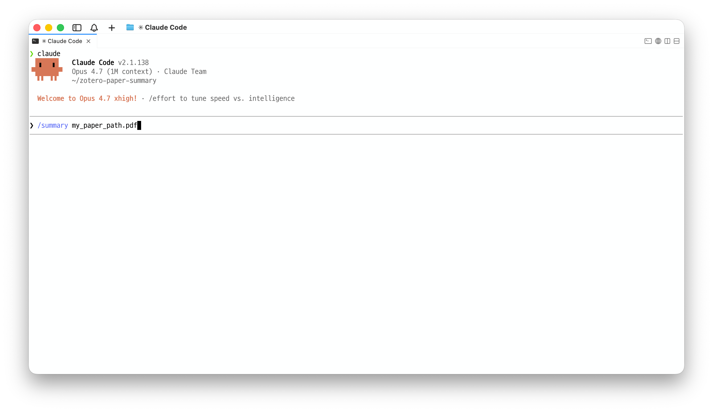

<p align="center">
  
</p>

<h1 align="center">AI Summary for Zotero</h1>

<p align="center">
  <a href="https://www.zotero.org"></a>
  <a href="LICENSE"></a>
  <a href="https://github.com/ajs7270/zotero-ai-summary/releases"></a>
  <a href="#usage"></a>
</p>

**AI Summary for Zotero** turns AI-assisted paper reading into structured Zotero child notes. A local Zotero plugin exposes a small HTTP API, and two AI-CLI skills (`summary` and `pinpoint-lesson`) use it to save formatted notes with figures, tables, math, and highlights directly beside the paper in your library.

It is built for researchers who already use Zotero and want their AI agent's paper-reading output to become durable Zotero notes instead of loose Markdown files.

<p align="center">
  <video src="assets/preview.mp4" controls muted playsinline width="720"></video>
</p>

<p align="center"><em><a href="assets/preview.mp4">Watch the full demo</a></em></p>

---

## Usage

Before using the skills, the **Zotero plugin must be installed and enabled**. Once the plugin is loaded and the skills are installed, call either skill from your AI CLI:

> **Recommended CLI.** `/summary` and `/pinpoint-lesson` work across Claude Code, Codex CLI, and Gemini CLI, but **Codex CLI or Claude Code are recommended** for more reliable long-form instruction following and Zotero note registration.

<p align="center">
  
</p>

```text
/summary          <PDF-path | Zotero-paper-title | citation-key> [language: <language>]
/pinpoint-lesson  <PDF-path | Zotero-paper-title | citation-key> [language: <language>]
```

Examples:

```text
/summary  /Users/me/papers/DeepSeek-V4.pdf
/summary  /Users/me/papers/attention-paper.pdf  language: Korean

/pinpoint-lesson  "DeepSeek-V4: Scaling Sparse Mixture-of-Experts"
/pinpoint-lesson  @deepseekv42026
/pinpoint-lesson  @paper2026  language: Korean
```

The agent extracts evidence from the PDF, drafts the Markdown note from the selected skill, and sends it to `localhost:23119/aisummary/note`. The plugin saves the result as a child note of the matched Zotero item.

### Arguments

| Field | Required | Meaning |
|---|---:|---|
| `<skill>` | Yes | `summary` or `pinpoint-lesson`. |
| `<target>` | Yes | Local PDF path, Zotero paper title, or citation key such as `@smith2026`. Quote titles or paths with spaces if your CLI requires it. |
| `language: <language>` | No | Output language for note prose, table cells, bullets, and quiz Q/A text. If omitted, the agent uses your request language, then English as fallback. |

The note is always registered under an existing Zotero item. If you pass a local PDF that is not already in Zotero, the agent will ask you to add it first and then retry the lookup.

---

## Installation

Setup has three parts:

The Zotero plugin is required. The skills cannot create Zotero notes by themselves; they send the generated note to the local plugin endpoint at `localhost:23119/aisummary/`.

| Step | What happens |
|---|---|
| 1. Skills | `summary` and `pinpoint-lesson` are copied into your selected AI CLI skill directories. |
| 2. Zotero plugin | The latest `zotero-ai-summary-X.Y.Z.xpi` is downloaded; you install it through Zotero's plugin manager. |
| 3. Dependencies | Poppler (`pdftotext`, `pdfimages`, `pdftoppm`) and Python 3 are checked. Missing tools are reported with install hints. |

### Bootstrap script

```bash
/bin/bash -c "$(curl -fsSL https://raw.githubusercontent.com/ajs7270/zotero-ai-summary/main/install.sh)"
```

The script is interactive. It can install the skills for:

| CLI | Skill paths |
|---|---|
| Claude Code | `~/.claude/skills/{summary,pinpoint-lesson}/` |
| OpenAI Codex CLI | `~/.codex/skills/{summary,pinpoint-lesson}/` |
| Google Gemini CLI | `~/.gemini/skills/{summary,pinpoint-lesson}/` |

Zotero 9 requires plugin installation through the GUI: `Tools` -> `Plugins` -> gear menu -> **Install Plugin From File...** -> select the downloaded `.xpi`.

To install only one skill:

```bash
AI_SUMMARY_SKILLS=summary           bash install.sh
AI_SUMMARY_SKILLS=pinpoint-lesson   bash install.sh
```

### Manual install

1. Download the latest [`zotero-ai-summary-X.Y.Z.xpi`](https://github.com/ajs7270/zotero-ai-summary/releases/latest) and install it through Zotero's plugin manager.
2. Copy the skill folders into your AI CLI's skills directory:

   ```bash
   cp -R skill/summary          ~/.codex/skills/summary
   cp -R skill/pinpoint-lesson  ~/.codex/skills/pinpoint-lesson

   cp -R skill/summary          ~/.claude/skills/summary
   cp -R skill/pinpoint-lesson  ~/.claude/skills/pinpoint-lesson

   cp -R skill/summary          ~/.gemini/skills/summary
   cp -R skill/pinpoint-lesson  ~/.gemini/skills/pinpoint-lesson
   ```

3. Install Poppler and Python 3:

   ```bash
   brew install poppler python                  # macOS
   sudo apt install poppler-utils python3       # Ubuntu / Debian
   sudo pacman -S poppler python                # Arch
   ```

---

## Skills

Both skills use the same Zotero plugin, PDF extraction helpers, image pipeline, math rendering path, and HTML sanitizer. They differ only in note depth.

| Skill | Output | Use when |
|---|---|---|
| `summary` | Concise structured note covering research questions, method, results, limitations, and takeaways. | You want a quick reference summary in Zotero. |
| `pinpoint-lesson` | Long-form lesson with mathematical preliminaries, idea provenance, method derivation, fundamental "why", and insight quizzes. | You want a deep, reusable, math-grounded lesson note. |

---

## Features

- **Zotero-native notes.** Results are saved as child notes under matched Zotero items.
- **Paper figures included.** Raster figures are extracted with `pdfimages`; vector-only pages can be rendered with `pdftoppm`.
- **Math rendering.** Inline LaTeX (`$...$`) is converted for Zotero's KaTeX note renderer.
- **Portable skills.** The same skills install into Claude Code, OpenAI Codex CLI, and Google Gemini CLI.
- **Self-contained plugin.** The converter uses bundled `markdown-it` 14.x. No companion plugin or web API credentials are required.

---

## Troubleshooting

**Zotero is not running.** Open Zotero and retry `curl http://localhost:23119/aisummary/health`.

**Plugin is missing or disabled.** In Zotero, open `Tools` -> `Plugins` and confirm **AI Summary for Zotero** is installed and enabled. If `/aisummary/health` returns 404, reinstall the latest `.xpi`.

**Poppler or Python is missing.** Install them with `brew install poppler python` on macOS or `sudo apt install poppler-utils python3` on Ubuntu/Debian.

**The CLI does not show `/summary` or `/pinpoint-lesson`.** Confirm the skill folders are in the right CLI directory, then restart the CLI.

**Zotero version is too old.** The plugin requires Zotero 9.0+.

---

## Development

```bash
bash build.sh
# -> dist/zotero-ai-summary-X.Y.Z.xpi

curl http://localhost:23119/aisummary/health
```

The plugin source is plain JavaScript with no transpile step. `markdown-it.min.js` is vendored in `plugin/lib/vendor/`.

Further details:

- [HTTP protocol](docs/PROTOCOL.md)
- [Plugin design](docs/DESIGN.md)

---

## Acknowledgements

The bundled converter is [markdown-it](https://github.com/markdown-it/markdown-it).

---

## License

MIT. See [LICENSE](LICENSE).
